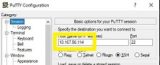
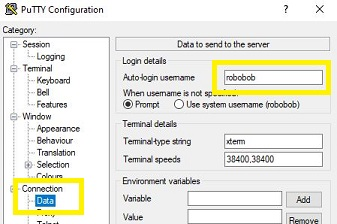
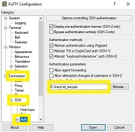
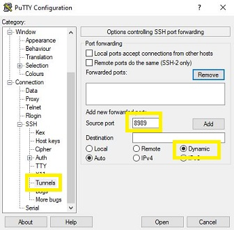
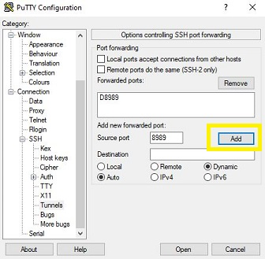
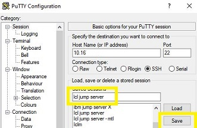
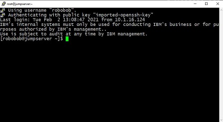
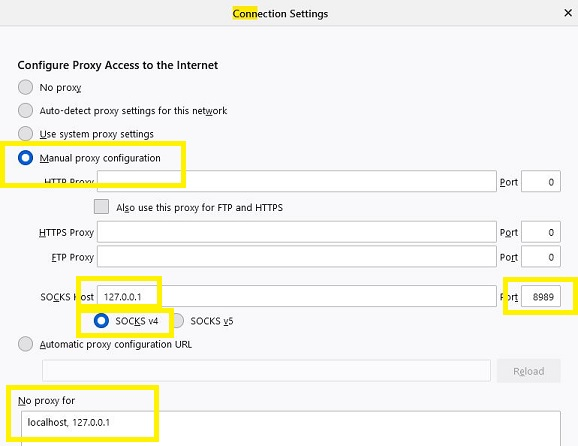
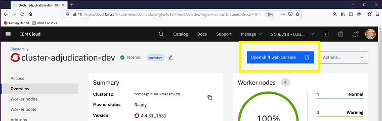
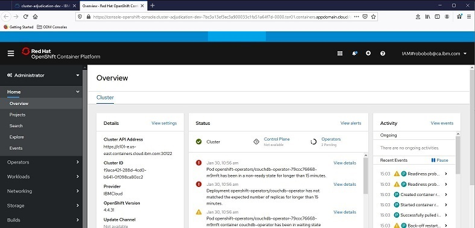

# Firewalled OpenShift Console Access over the IBM Cloud VPN

## Introduction
Greetings!

If need access to firewalled OpenShift Consoles on IBM Cloud, you must first get access to the account jumpserver.  After that follow these instructions:

## Pre-req Work

Make sure you have set up your VPN password for the IBM Cloud VPN and installed the recommended VPN client:

https://cloud.ibm.com/docs/iaas-vpn?topic=iaas-vpn-getting-started

## Step 0 - Running a Mac?

Open a command line window and type:

```
ssh -i [path_to_privkey] <jumpserver id>@<jumpserver IP> -D 8989
```

Then skip to step 8.

## Step 1 - Install Putty

https://www.putty.org

## Step 2 - Set up the connection

Launch putty and create a new connection by entering in the VPN IP address of the jumpserver:



## Step 3 - Add your user name

Open up the Connection-->Data window and add your linux jumpserver id:



## Step 4 - Add your SSH private key

Open up the Connection-->SSH-->Auth window and add your private key:



## Step 5 - Add an SSH tunnel

Open the Connection-->SSH-->Tunnels window and add port 8989 as a dynamic destination.  Be sure to click the Dynamic radio button, and the add button after typing in the port:


<BR>


## Step 6 - Save your changes

Go back to the Session window, give your connection a name, and then click the save button.



## Step 7 - Launch putty

Make sure you are connected to the IBM Cloud VPN first:



## Step 8 - Configure the SOCKS proxy on your browser

Open up the connection settings on your browser (Firefox has this, but Chrome browsers want to change your system proxy settings.  I suggest you use Firefox).  Do the following

```
Select manual proxy configuration
Set your SOCKS Host to 127.0.0.1 on port 8989
Set SOCKS version to v4
Set localhost, 127.0.0.1 as your no proxy list
```



## Step 9  - Surf!

Surf to cloud.ibm.com, log in, select the proper account, select an OpenShift cluster and then click on the `OpenShift web console` button.  



If the console page is a little on the blank side, just do a reload of the page:




Please remember to un-set your proxy settings for regular web surfing, or everything you do will be proxied through IBM Cloud
