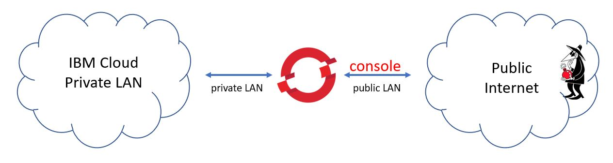
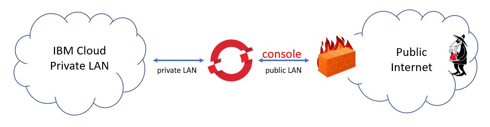
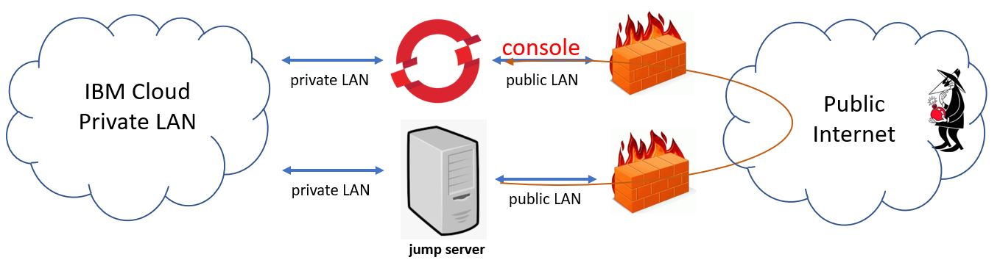
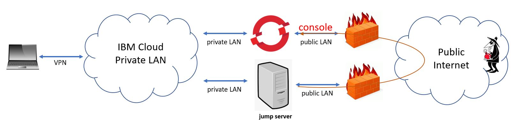
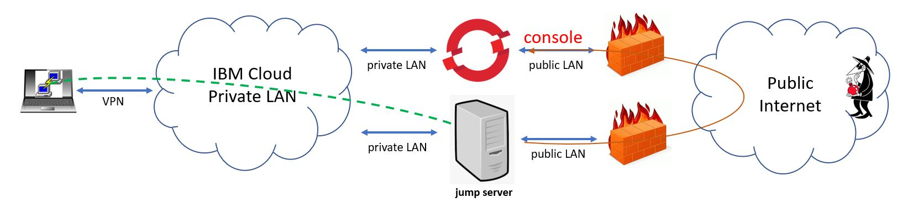
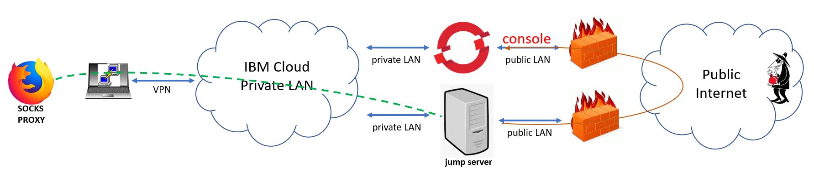
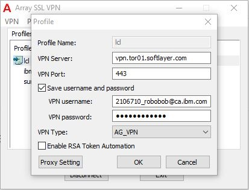
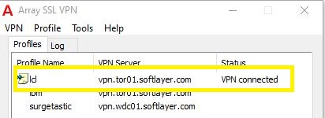

# Firewalled Classic Network OpenShift Console Access over the IBM Cloud VPN

## Introduction
Greetings!

When OpenShift clusters are created on IBM Cloud Classic infrastructure, they look a bit like this:



They have a public lan interface, as well a private one.  On Classic infrastructure the OpenShift console sits on the public LAN (On VPC Clusters, they can sit on the private LAN).  In order to protect the console, therefore, we need to put a firewall in front of it:



The console is now protected, but unavailable to everyone.  To solve this issue we create a jump server in the same account, and set firewall rules to allow access to the console:



So now we can access the console from the jump server, but we want to be able to access it from our own machine.  To accomplish this, we need to install a VPN client and use it to connect to the IBM Cloud Private LAN:



Once we have the VPN connection established, we need to open up an SSH tunnel to the jump server, using a tool like puTTY:



With a tunnel established we can now configure a browser like Firefox to use the tunnel as a SOCKS proxy, and safely access the OpenShift console:




Therefore, to get access you must do THREE things:
<ul>
<li>Connect to the private LAN of the account using a VPN client</li>
<li>Establish an SSH connection to a jumpserver over the VPN connection</li>
<li>Configure your browser to use the SSH connection as a SOCKS proxy</li>
</ul>

To access the jumpserver, you need to generate an RSA SSH keypair and send in your public key.  On a Mac, use the `ssh-keygen` command line tool.  On a PC, download puttygen to generate a key-pair and send the OpenSSH key that displays at the top of the puttygen window. The public key must look something like this:

```
ssh-rsa AAAAB3NzaC1yc2EAAAADAQABAAABAQC1YaIO7BueeiyAENrCPu3+rSEvvm6QupU1p4crCqYITgw3+kvVmbkI1bJvSuDZ38JUSMYzirsXLeCvI3df3i9EPqRiF4rlApGXcc4q0Mheia75HBXxx6D92us3J35GOVAtS+1dqMNmc9JX7uz1HR5b3hqPGjUgzbjPOJjz460p408y16hezHupRMcP4X8B8IEka2e/h6qhdNdLkarFdZtXVZd1IxQcUcmmkz2s+95KgkZ7j6j+4rK43otPQUdk/qwT3CFE3ko35FzkUJIgjYt34edMsxF11dQclNBjIiJUWjmhOm0F4H2s5UIL98rt4O7vYM31LEtlq75KLmq6Ii43 robobob@jumpserver.robobob.ca
```

After you send in your public key, follow these instructions:

## Step 0: Set up VPN Client

Make sure you have set up your VPN password for the IBM Cloud VPN <B>in the customer's account</B> and installed the recommended VPN client:

https://cloud.ibm.com/docs/iaas-vpn?topic=iaas-vpn-getting-started

Configure the VPN client with your VPN ID and password:



## Step 1 - Running a Mac?

Connect to the VPN, open a command line window, and type:

```
ssh -i [path_to_privkey] <jumpserver id>@<jumpserver IP> -D 8989
```

Then skip to step 9.

## Step 2 - Install Putty

https://www.putty.org

## Step 3 - Set up the connection

Launch putty and create a new connection by entering in the VPN IP address of the jumpserver:


## Step 4 - Add your user name

Open up the Connection-->Data window and add your linux jumpserver id:


## Step 5 - Add your SSH private key

Open up the Connection-->SSH-->Auth window and add your private key:


## Step 6 - Add an SSH tunnel

Open the Connection-->SSH-->Tunnels window and add port 8989 as a dynamic destination.  Be sure to click the Dynamic radio button, and the add button after typing in the port:


<BR>


## Step 7 - Save your changes

Go back to the Session window, give your connection a name, and then click the save button.


## Step 8 - Launch putty

Disconnect any other VPN's you may be connected to.  Then make sure you are connected to the IBM Cloud VPN:



Then open your putty connection:


## Step 9 - Configure the SOCKS proxy on your browser

Open up the connection settings on your browser (Firefox has this, but Chrome browsers want to change your system proxy settings.  I suggest you use Firefox).  Do the following

```
Select manual proxy configuration
Set your SOCKS Host to 127.0.0.1 on port 8989
Set SOCKS version to v4
Set localhost, 127.0.0.1 as your no proxy list
```


## Step 10  - Surf!

Surf to cloud.ibm.com, log in, select the proper account, select an OpenShift cluster and then click on the `OpenShift web console` button.  


If the console page is a little on the blank side, just do a reload of the page:


Please remember to un-set your proxy settings for regular web surfing, or everything you do will be proxied through IBM Cloud
